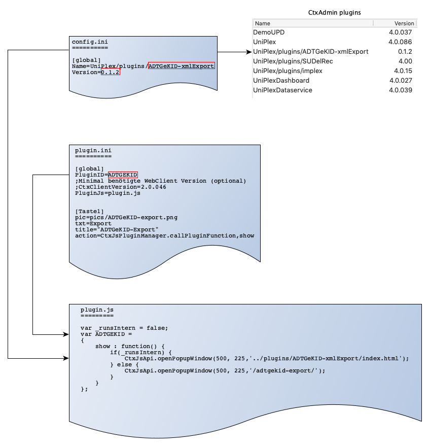

CortexDB Uniplex-Plugins Beispiele
==================================

[English translation here...](README.md)

- - -

Voraussetzungen
---------------

Mindestens UniplexDataservice (UniplexAPI) 4.0.040

Beschreibung
------------
Dieses Repository dient zur Sammlung von Beispielen der Plugin-Entwicklung für den CortexDB Uniplex. 




Plugin-Entwicklung
------------------

- **config.ini** - legt fest, wie das Plugin in der Administration aufgeführt wird (Liste im `ctxadmin`)
- **plugin.ini** - Legt fest, wie das Plugin innerhalb des Uniplex verwaltet wird (Plugin-Templates)
- **plugin.js** - legt fest, wie das Plugin im Uniplex dargestellt wird (als Popup, in einer Bildschirmhälfte oder nur als Funktion ohne Fenster) und wo es abgelegt wurde (DB-intern oder im ww-Verzeichnis)


### Parameter der `config.ini`

```ini
[global]
Name=UniPlex/plugins/MyPluginName
Version=0.1.0
```

Der `Name` legt den Pfad innerhalb der Uniplex-Struktur und den Namen des Plugins fest.

Die Version dient zur Unterscheidung verschiedener Versionen und kann frei definiert werden.


### Parameter der `plugin.ini`

```
[global]
PluginID=MyPluginID
;Minimal benötigte WebClient Version (optional)
;CtxClientVersion=4.0.086
PluginJs=plugin.js


[Taste1]
pic=pics/myPluginIcont.png		; Bild des Icons (42px x 32px)
txt=Export						; Titel des Icons, der unter dem Icon angezeigt wird
title="TooltipForPluging"		; Tooltip des Icons
action=CtxJsPluginManager.callPluginFunction,show
```

### Inhalt der `plugin.js`


```JavaScript
var MyPluginID =
{
	show : function()
	{
		CtxJsApi.openPopupWindow(500, 225,'../plugins/MyPluginName/index_open.php');

		//** zulässige Aufrufe zur Anzeige in versch. Bereichen **//
		*/
		CtxJsApi.openPopupWindow(500, 225, '../plugins/MyPluginName/index_open.php'); // modaler Dialog
		CtxJsApi.openLeftWindow(1000, 900, '--Name--', '../plugins/MyPluginName/index.php'); // Tab links
		CtxJsApi.openRightWindow(1000, 900, '--Name--', '../plugins/MyPluginName/index.php'); // Tab rechts
		CtxJsApi.openHiddenWindow("../plugins/MyPluginName/index.php"); // ohne Fenster
		*/
	}
};
```

Die Variable muss genauso bezeichnet werden, wie die `PluginID` in der Datei `plugin.ini`.

Die Funktion `show` legt fest, welches Plugin (siehe `cinfog.ini`) mit welcher Dialog-Größe geöffnet werden soll.
