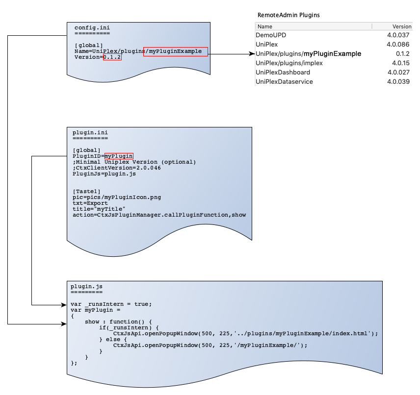

CortexDB Uniplex-Plugin Examples
================================

[German translation here...](README-de.md)

- - -

This repository is used to collect examples of plugin development for CortexDB Uniplex. 




Plugin-Development
------------------

- **config.ini** - specifies how the plugin is listed in the administration (list in `ctxadmin`)
- **plugin.ini** - Defines how the plugin is managed within the Uniplex (Plugin-Templates)
- **plugin.js** - defines how the plugin is displayed in Uniplex (as popup, in one half of the screen or only as function without window) and where it is stored (DB-internally or in the ww directory)


###Parameter for `config.ini`

```ini
[global]
Name=UniPlex/plugins/MyPluginName
Version=0.1.0
```

The `Name` defines the path within the Uniplex structure and the name of the plugin.

The version is used to distinguish between different versions and can be freely defined.


###Parameter in `plugin.ini`

```
[global]
PluginID=MyPluginID
;Minimal Uniplex Version (optional)
;CtxClientVersion=4.0.086
PluginJs=plugin.js


[Taste1]
pic=pics/myPluginIcon.png		; Image of icon (42px x 32px)
txt=Export						; Title of icon, which is displayed beneath the icon
title="myIconTooltip"			; Tooltip of icon
action=CtxJsPluginManager.callPluginFunction,show
```

###Content of `plugin.js`


```JavaScript
var MyPluginID =
{
	show : function()
	{
		CtxJsApi.openPopupWindow(500, 225,'../plugins/MyPluginName/index_open.php');

		//** Allowed calls for display in different areas **//
		*/
		CtxJsApi.openPopupWindow(500, 225, '../plugins/MyPluginName/index_open.php'); // modal dialogue
		CtxJsApi.openLeftWindow(1000, 900, '--Name--', '../plugins/MyPluginName/index.php'); // tab left
		CtxJsApi.openRightWindow(1000, 900, '--Name--', '../plugins/MyPluginName/index.php'); // tab right
		CtxJsApi.openHiddenWindow("../plugins/MyPluginName/index.php"); // without window
		*/
	}
};
```

The variable must be named in the same way as the `PluginID` in the `plugin.ini` file.

The `show` function determines which plugin (see `config.ini`) should be opened with which dialog size.
